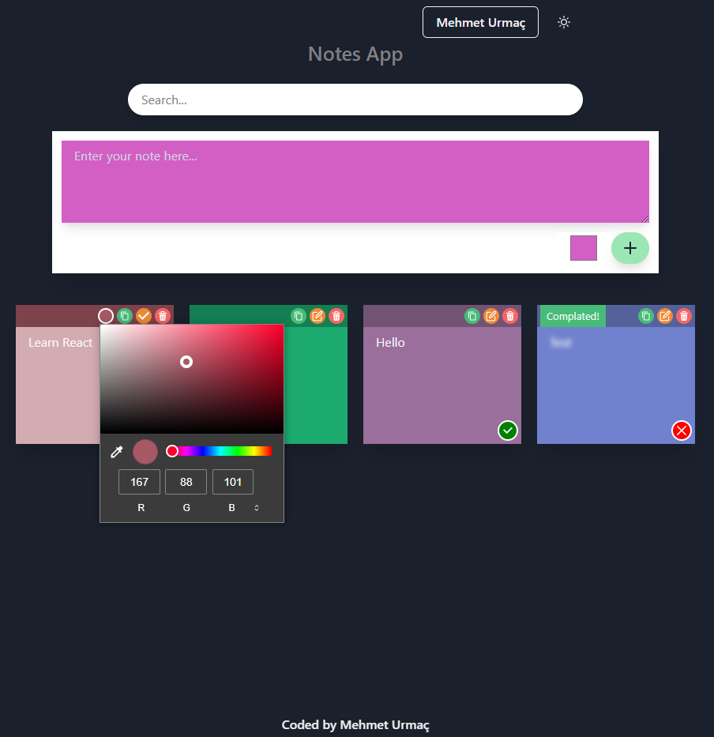
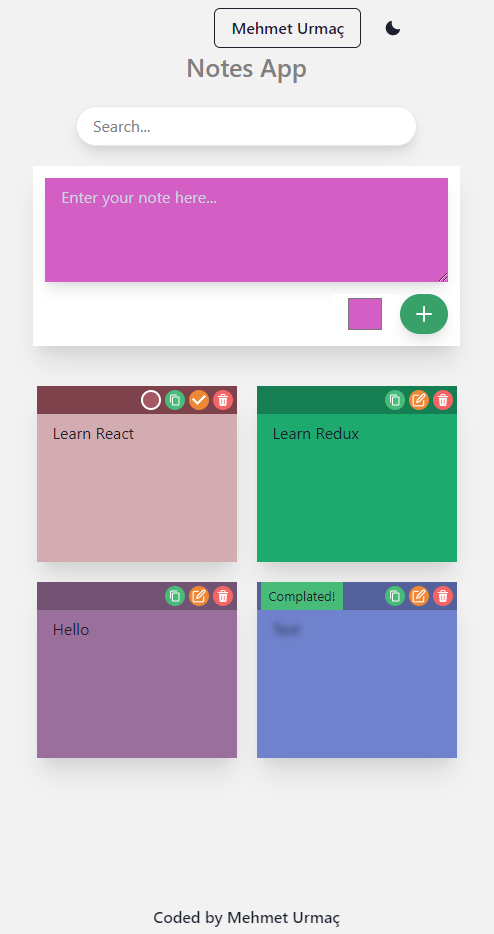
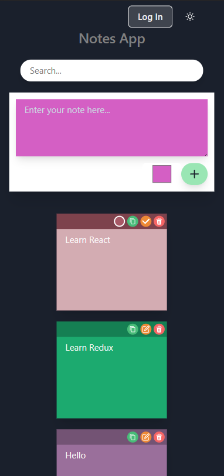

# Redux Notes App

> https://notes-redux.netlify.app/

---

---

- API: [mockapi.io](https://mockapi.io)

- [chakra-ui](https://chakra-ui.com/)

- Responsive design

- Light/Dark Mode

  
   

## License

[MIT](https://choosealicense.com/licenses/mit/)
